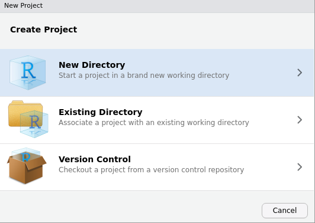
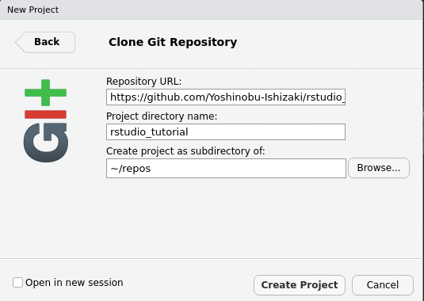

# rstudio_tutorial
tutorial files to study rstudio

## Abstract

目的：RStudioを使用したデータ分析初歩のサンプルファイル群を提供する。

## Usage

RStudioから`New Project...`を選ぶ。

3段目のVersion Controlを選択。

リポジトリのアドレスをペーストして、適当なディレクトリを指定して`Create Project`する。

## Files

- [tutorial1.Rmd](./tutorial1.Rmd) : 基本のRNotebookファイル。
- [tutorial2-flights.Rmd](./tutorial2-flights.Rmd) : NYFLIGHTSデータの分析。

