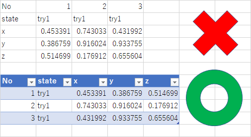
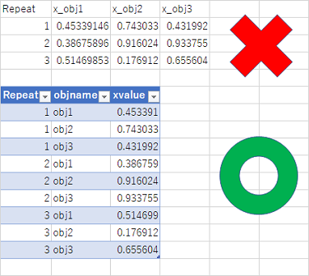
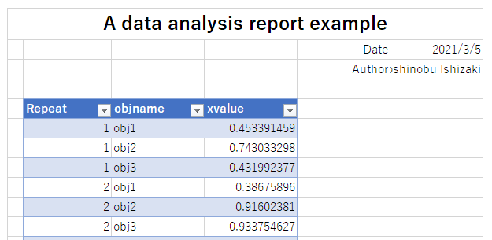
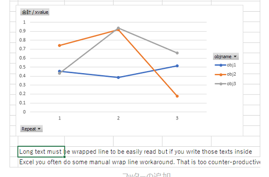

```{r setup, include=FALSE}
options(htmltools.dir.version = FALSE)
library(tidyverse)
options(dplyr.summarise.inform=FALSE)
```


# Basic rules

1. Pyle up data vertically

1. Column for property, Row for each observation

1. Divide column name by '_' only ( Especially don't use spaces! )

  So called `snake_case` typing

1. Separate data and report (Consider using RStudio and RMarkdown)

---

# Pyle up data vertically



Almost all data analysis system (including Excel `Table`) assumes that data are vertically inputted.

---

# Column for property, Row for each observation



You can use power of `filtering` and `Pivot Table(Excel)` or `group_by` summary(R, Python).

---

# Divide column name by '_' only

**Column_title_must_be_divided_only_by_underscore !**

Then you can avoid ugly workaround of Table functions, R, python code.

```{r}
names(iris) <- c("Sepal Length", "Sepal_Width" ,
                 "Petal_Length", "Petal_Width","Species")
# must escape with ` to avoid error
iris %>% group_by(Species) %>% 
  summarise(mean(`Sepal Length`)) #<<
```

Result is a bit ugly, hard to read.

---

# Divide column name by '_' only

```{r}
iris %>% group_by(Species) %>% 
  summarise(mean(Sepal_Width)) #<< 
```
Better. Easy to write/read code.

---

# Separate data and report

If you mixed up data/plot/report inside same Excel file, 

- You will soon encounter disasterous formatting errors.

- It is hard to add data without re-formatting.

- It is hard to be reused for another data analysis.


---

# Separate data and report



Bad things used above.
--

- Left unused spacer column
--

- Cell concatination for title
--

- Right aligned date and name( name being clipped )
--

- Data starts at 5th row 2nd column (who can imagine that?)

---

# Separate data and report



Bad things used above.
--

- Ugly alignment of plot
--

- Description texts written in cells and must be wrapped line manually.
--

- Texts are clipped at right

---

# Separate data and report

## Use RMarkdown!

- Use Excel to save data only
  - Data must start at 1st row, 1st column
  - Separate data sheet and other information
- Texts shold be written in a RMarkdown file
- Save pictures into sub-folder

## You earn more productivity!

- Power of R!
- Reproducible reports
- Automatic formatting 
- Version control (git, gitlab)

