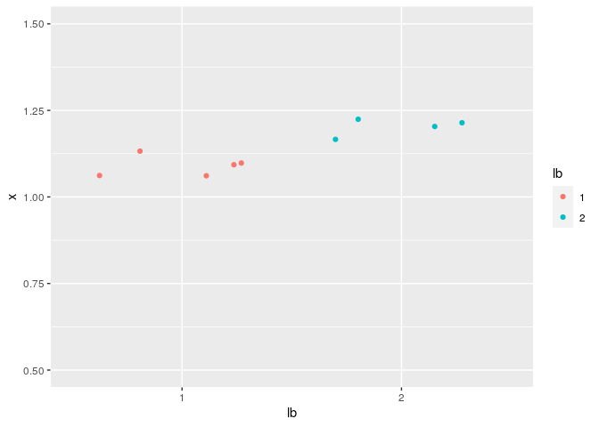
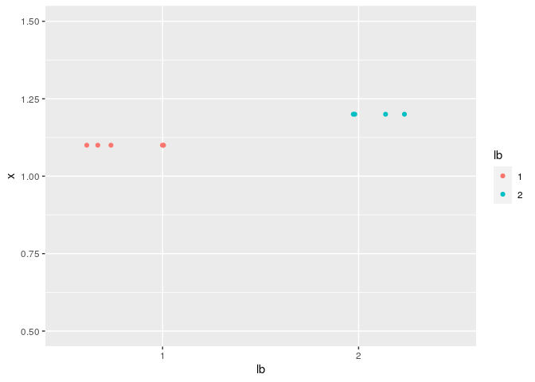
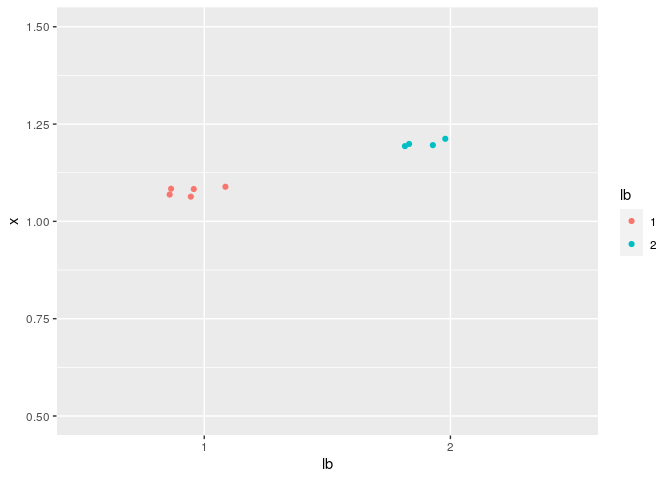
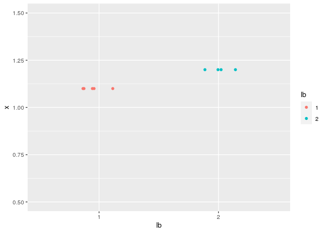

ggplot: geom\_jitter
================
Yoshinobu Ishizaki
2021-04-04

-   [1 Jitterプロットの性質](#jitterプロットの性質)
-   [2 Math test](#math-test)

# 1 Jitterプロットの性質

``` r
library(tidyverse)
```

``` r
x <- c(rep(1.1,5),rep(1.2,4))
y <- c(rep("1",5),rep("2",4))

dfm <- tibble(x = x, lb = y)
```

オプションを指定しないと、X,Y両方向に適度にバラけてしまう。

``` r
dfm %>% ggplot(aes(x = lb, y = x, color = lb)) +
    geom_jitter() + ylim(0.5,1.5)
```

<!-- -->

`height = 0`と指定することで、Y方向の散らしを抑制できる。

``` r
dfm %>% ggplot(aes(x = lb, y = x, color = lb)) +
    geom_jitter(height = 0) + ylim(0.5,1.5)
```

<!-- -->

`width = 0.2`という指定だけではY方向の散らばりは抑制できない。

``` r
dfm %>% ggplot(aes(x = lb, y = x, color = lb)) +
    geom_jitter(width = 0.2) + ylim(0.5,1.5)
```

<!-- -->

X,Y両方をコントロールしたいなら、width, height 両方を指定しないとダメ。

``` r
dfm %>% ggplot(aes(x = lb, y = x, color = lb)) +
    geom_jitter(width = 0.2, height = 0) + ylim(0.5,1.5)
```

<!-- -->

# 2 Math test

Basel equation

$$
\\sum\_{n = 1}^{\\infty} \\frac{1}{n^2} = \\frac{\\pi^2}{6}
$$
