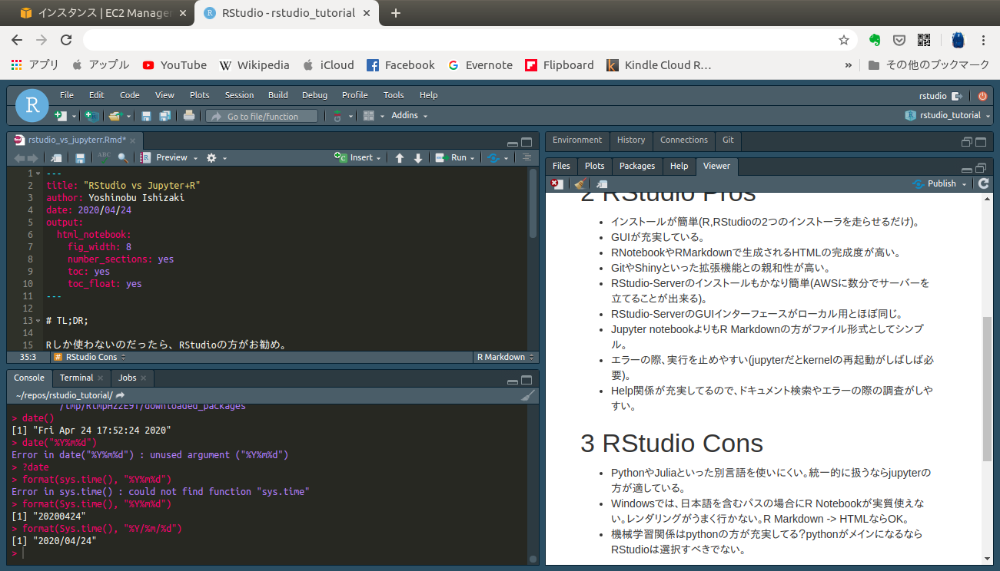

# Rプロジェクト



RStudioを起動すると、図のような画面になる。

まず最初に右上の`R`のアイコンから`New Project`または`Open Project`でプロジェクトを作成するか既存のプロジェクトを開く。

プロジェクトの中で、複数の分析ファイルを扱うことができるので、好みのまとまりごとにプロジェクトを作成すると良い。

# R Notebook / R Markdown

分析ファイルの基本はR Notebook。新規ファイルを選ぶアイコンからR Notebookを選択。

プリアンブル（ファイルの基本設定）には

```
---
title: "TITLE OF DOCUMENT"
author: Your Name
date: YYYY/MM/DD
output: 
  html_notebook: 
    fig_width: 8
    fig_height: 4.5
    number_sections: yes
    toc: yes
    toc_float: yes
---
```

と記載すると見栄えの良い報告書が出来る。

Windowsでファイルパスに日本語などNon-Asciiを含む場合にはR NotebootではなくR Markdownを選択して、knit to HTMLを選択すると良い。
R Notebookとして作成したファイルのプリアンブルの`output:`を`html_notbook`から`html_markdown`とするだけでR Markdownに処理が変更される。

R Notebook, R Markdownファイルの中でRコードと地の文章を記入して分析報告書を作成する。

Rコードは\`\`\` で囲み、{r}をつける。`Ctrl-Alt-I`でコードブロックが挿入される。
````
```{ r}
1+3 
```
````

```{r}
1+3 
```

コードのある行で`Ctrl-Enter`するとその行が実行される。コードブロック内で`Ctrl-Shift-Enter`すると、コードブロック全体が実行される。
`Ctrl-Alt-N`で、次のコードブロックの実行になる。

数式は`$$`で囲む。

```
$$
x = 1+3
$$
```

$$
x = 1+3
$$

`$`1つだけで囲むと文の途中に挿入できる。ギリシャ文字などを文内で使いたい時に便利。

```
$\alpha$
```
と書くと、$\alpha$となる。

R Notebook/R Markdownの記述をしながら`Ctrl-Shift-K`すると、内容がフォーマットされHTML形式などで見ることが出来るようになる。
最終的には生成されたHTMLファイルを共有することでRStudioをインストールしてない人でも内容を見れるようにする。

R Notebookなら、一度`Ctrl-Shift-K`でフォーマットしておくと、その後はR Notebookファイルを保存するだけでフォーマットも自動で行われる。


# Dataファイル

分析の元となるデータファイルはExcelやCSV形式のファイルとして、R Notebootと同じフォルダに保存するのが良い。

RStudio-Serverを使っている場合、右ペインの`File`タブに`Upload`アイコンがあるので、それを押してローカルファイルをアップロードする(ダウンロードする場合は`More`→`Export`)。

`Connection`からDBサーバに接続することも出来る。

