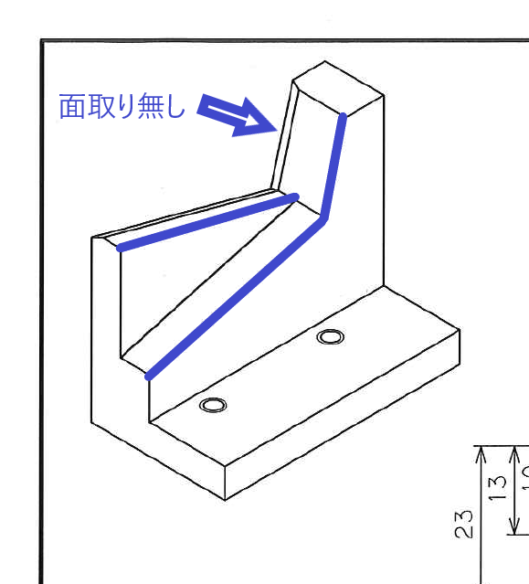

# タイトル

R-4.0.2 + RStudio-1.4 のテスト。

```{r, echo=FALSE, message=FALSE}
library(tidyverse)
library(readxl)

```

{width="200"}

```{r}
plot(cars2)
```

```{r}
# x <- 1+3
```

```{r}
library(reticulate)
```
