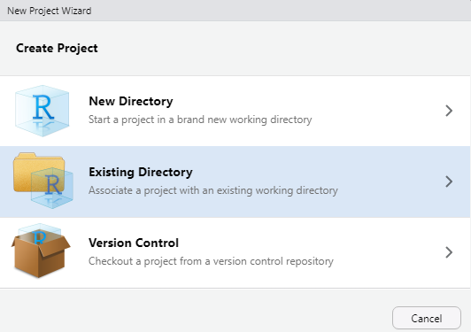

```{r setup, include=FALSE}
options(htmltools.dir.version = FALSE)
options(dplyr.summarise.inform=FALSE)
```

# Minimum guidelines

1. One RStudio project file (`.Rproj`) for one project

1. Use RNotebook format mostly

1. Keep business report structure

1. Read, Plot, Summarise

1. Gitlab markdown output (Optional)

# One RStudio project file (`.Rproj`) for one project

RStudio is handled by `.Rproj` file. 
It is better to create one such file for each of your project folder like gitlab repository.

Then it is easily linked to git version control inside RStudio.



<!-- {width="240"} -->

# Use RNotebook format mostly

It creates `.nb.html` when rendered.
Writing typical YAML preamble below enables floating numbered toc.
It helps you much to move across your report.

```
---
title: "R Notebook Title"
author: "Your Name"
date: "2020-MM-DD"
output: 
  html_notebook:
    toc: true
    toc_float: true
    number_sections: true
---
```

Indent is important. Do not change spaces at each line's beginning.

# Keep business report structure

Even in RStudio, you should be better to write your report in a business manner.

- **A**bstract
- **B**ackground
- **C**onclusion
- **D**iscussion or **D**etail

# Read, Plot, Summarise

In Discussion(Detail) section, you should read/plot/summarise your data.

## Read

First you need basic library loaded.

```{r, message=FALSE, warning=FALSE}
library(tidyverse) # various data manipulation packages 
library(readxl) # to read excel file
```


Then read your data.

```{r}
dfm <- read_excel("iris.xlsx",sheet = "Sheet1")
```

## Plot

Next thing you should do is plotting (Visualization).
Image tells you a lot more than boring numbers.

## 
Basic code is here.Use jitter to avoid overlapping points.

```{r}
dfm %>% ggplot(aes(x = Species, y = Sepal_Length, color = Species)) +
  geom_jitter(width = 0.2, height = 0) + 
  ylim(0,10) + 
  geom_hline(yintercept = c(5,7), color = "red") + 
  labs(title = "Iris data")
```
## Summarise

After investigating data by plotting, you need summary of your data numerics.

```{r}
dfm %>% group_by(Species) %>% summarise(mean(Sepal_Length))
```
# Gitlab markdown output (Optional)

When using RMarkdown with Gitlab, it is better to convert your RMarkdown code into normal Markdown.
You can make your report viewable on Gitlab projects' web site.

Add YAML code below and choose `knit to md_document`.

```
md_document:
    toc: true
    variant: gfm
```

If your RMarkdown code includes math expression, refer to Gitlab lua filter docs [here](https://gitlab.scm.service.infosys.yamaha.com/bo_pe/about_bo_pe/-/blob/master/doc/gfm.md#7-rmarkdown-math-1).


# End note

This file's source can be found at https://github.com/Yoshinobu-Ishizaki/rstudio_tutorial/tree/master/rstudio_intro_ympi/

