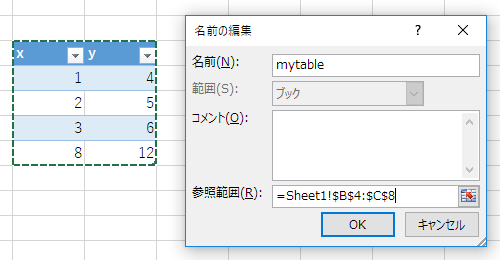

# Excel Table

```{r}
# library(tidyverse)
library(openxlsx)
```

Excel側で読み取りたい範囲に名前をつけておくと、read.xlsxで名前指定で読み込める。

名前範囲とテーブルはかぶっていていいが、先に名前を定義して参照先が`A1:C30`のような形式になっていること。



すると、名前を指定してデータをRに読み込むことができる。

```{r}
dfm <- read.xlsx("excel-table.xlsx", namedRegion = "mytable")
```

```{r}
dfm
```

