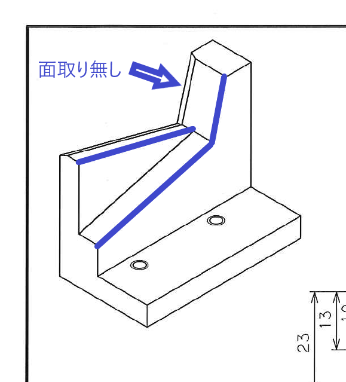

# Abstract

このRMarkdownファイルはRStudio 1.4で導入されたVisual Modeを使用して作成する。

```{r}
plot(cars)
```

非常に便利だね。

だが、Preview Release 1.4.904の段階ではInsert Imageなどのコマンドに割り当てられているはずのショートカットが効かない。

{width="50%"}

メニューから選択すると普通に入れることができるので、あまり困ることはないが。他のフォルダから画像を選択すると自動的にそのコピーがimagesサブフォルダに保存されるのも良し。

テーブルの入力もVisual Modeなら非常にやりやすい。

+----------------------------------------------------------------+--------------+------------------------------------------+
| 列1                                                            | 列2          | 列3                                      |
+================================================================+==============+==========================================+
|                                                                |              | 長いセル内容の場合にセル内で改行するのも |
|                                                                |              |                                          |
|                                                                |              | 出来上がりの状態を見ながら               |
|                                                                |              |                                          |
|                                                                |              | 編集できるので非常に良い。               |
+----------------------------------------------------------------+--------------+------------------------------------------+
| 行の挿入を前にやるのか後ろにやるのかを、右クリックで選べるのも | 非常に良い。 | 実に素晴らしい機能だ。                   |
+----------------------------------------------------------------+--------------+------------------------------------------+

Visual Modeと普通のエディタモードをボタン1つで切り替えられるのもよく、Markdownの書き方に慣れていない場合に自習するのにも良い。 注釈を[^1]見給え。あ、注釈モードでちょっとバグった。

[^1]: Insertメニューから入れることができるのも、ものすごく便利。

```{r, warning=FALSE, message=FALSE}
library(tidyverse)
```

```{r}
cars
```

```{r}
cars %>% ggplot(aes(x = speed, y = dist)) + 
  geom_point()
```

すごく編集しやすい。これは皆さんにお知らせしなくては。

# タイトルも入れやすい

なんてこったい。しかも先頭で\#とスペースを入れ直すと自然にヘッディングの段階が変更される。勿論ショートカットもあるし、メニューにも書いている段落の書式を変更するところがある。

但し、Ctrl-/ がなにかをInsertするためのショートカットになってるのがちょっと残念。このショートカットはVSCodeなどでは、コメントのトグルに使われているので。

```{r}
faithful %>% ggplot(aes(x = waiting, y = eruptions)) + 
  geom_point()
```

あ、でもコードの中でのカスタマイズは効いている。Visual Modeの地の分ではRStudioのデフォルトであるCtrl-Shift-Cでコメントのトグルになる。アンコメントが、無い、かな？どうやら新しいバージョンで動作仕様が変更になっていて、メニューからもコメント化・非コメント化は使用不可になっている。まぁ、それならそれで慣れれば良いという程度のこと。

インラインの数式$\lambda$や、

$$
y = log_{10} x
$$

別行立ての数式も非常に見やすい。

ところでこのOld Faithfullのデータって面白い形しているな。明らかに2つのモードを持っている。
